# Kirbuk AWS Services Architecture

This document provides a comprehensive mermaid diagram of the AWS services architecture for the Kirbuk automated SaaS product video generation service.

## Architecture Diagram

```mermaid
flowchart TB
    subgraph "User Layer"
        User[👤 User]
        Email[📧 User Email]
    end

    subgraph "AWS Account"
        subgraph "Web Application Layer"
            Django["🌐 Django Web App<br/>(Gunicorn on EC2)"]
        end

        subgraph "Core Processing Layer"
            AgentCore["🤖 AWS Bedrock AgentCore<br/>ARN: agentcore_starter_strands<br/>Session-based Runtime"]
            Claude["🧠 Claude Sonnet 4<br/>(via Bedrock)"]
            Browser["🌐 AgentCore Browser Tool<br/>(Website Exploration)"]
        end

        subgraph "Storage Layer"
            S3["☁️ Amazon S3"]
        end

        subgraph "Media Services"
            Polly["🗣️ Amazon Polly<br/>Engine: Generative<br/>Voice: Matthew<br/>Output: MP3"]
            Playwright["🎬 Playwright Execution<br/>(Video Recording)<br/>1280x720 WebM"]
        end

        subgraph "Notification Services"
            SES["📬 Amazon SES"]
        end

        subgraph "Infrastructure Services"
            IAM["🔐 AWS IAM<br/>Execution Roles<br/>- AgentCore Runtime<br/>- CodeBuild"]
            ECR["📦 Amazon ECR<br/>Container Registry<br/>Agent Images"]
            CodeBuild["🔨 AWS CodeBuild<br/>Agent Deployment<br/>Pipeline"]
            CloudWatch["📊 CloudWatch<br/>(Monitoring)"]
        end

        subgraph "External Services"
            Sentry["🚨 Sentry"]
        end
    end

    %% User Interactions
    User -->|"1. Submit Form<br/>(email, URL, directions)"| Django
    Django -->|"2. Return submission_id<br/>(immediate response)"| User
    SES -->|"6. Email Notifications<br/>(start/success/failure)"| Email
    Email -->|"7. Click Status Link"| Django

    %% Web App to Core Processing
    Django -->|"3. invoke_agent_runtime()<br/>(background thread)<br/>session_id = submission_id"| AgentCore
    Django -->|"Query Status<br/>(head_object, get_object)"| S3
    Django -->|"Generate Presigned URLs<br/>(1-hour expiry)"| S3

    %% AgentCore Orchestration
    AgentCore -->|"4. Check Duplicate"| S3
    AgentCore -->|"5. Save Payload"| S3
    AgentCore -->|"Step 1: Explore Website"| Browser
    Browser -->|"Returns Narrative"| AgentCore
    AgentCore -->|"Step 2: Save script.txt"| S3
    AgentCore -->|"Step 3: Generate SSML"| Claude
    Claude -->|"voice_script.ssml"| S3
    AgentCore -->|"Step 4: start_speech_synthesis_task()"| Polly

    %% Polly Processing
    Polly -->|"Direct Output"| S3
    AgentCore -->|"Poll Status"| Polly

    %% Playwright Processing
    AgentCore -->|"Step 5: Generate"| Claude
    Claude -->|"Save Script"| S3
    AgentCore -->|"Step 6: Execute Automation"| Playwright
    Playwright -->|"Download Polly narration"| S3
    Playwright -->|"Merge Audio + Video"| S3

    %% Notifications
    AgentCore -->|"send_email()<br/>(start/success/failure)"| SES

    %% Infrastructure Dependencies
    AgentCore -.->|"Assume Role"| IAM
    CodeBuild -.->|"Build & Deploy"| AgentCore
    ECR -.->|"Pull Container Image"| AgentCore
    CodeBuild -.->|"Push Images"| ECR
    IAM -.->|"Permissions:<br/>S3, Polly, SES, ECR"| S3
    IAM -.->|"Permissions"| Polly
    IAM -.->|"Permissions"| SES

    %% Monitoring
    Django -.->|"Exception Tracking"| Sentry
    AgentCore -.->|"Exception Tracking"| Sentry
    AgentCore -.->|"Logs & Metrics"| CloudWatch

    %% Styling
    classDef userClass fill:#e1f5ff,stroke:#01579b,stroke-width:2px
    classDef webClass fill:#fff9c4,stroke:#f57f17,stroke-width:2px
    classDef coreClass fill:#f3e5f5,stroke:#4a148c,stroke-width:2px
    classDef storageClass fill:#e8f5e9,stroke:#1b5e20,stroke-width:2px
    classDef mediaClass fill:#ffe0b2,stroke:#e65100,stroke-width:2px
    classDef notifyClass fill:#fce4ec,stroke:#880e4f,stroke-width:2px
    classDef infraClass fill:#eceff1,stroke:#263238,stroke-width:2px
    classDef externalClass fill:#ffebee,stroke:#b71c1c,stroke-width:2px

    class User,Email userClass
    class Django webClass
    class AgentCore,Claude,Browser coreClass
    class S3 storageClass
    class Polly,Playwright mediaClass
    class SES notifyClass
    class IAM,ECR,CodeBuild,CloudWatch infraClass
    class Sentry externalClass
```

## Architecture Overview

### Key Components

**User Layer:**
- End users interact via web browser
- Receive email notifications for video generation status

**Web Application Layer:**
- Django web app running on Gunicorn
- Hosted on EC2 at https://kirbuk.sveder.com
- Handles form submissions and status queries

**Core Processing Layer:**
- AWS Bedrock AgentCore orchestrates the entire pipeline
- Claude Sonnet 4 for AI-powered content generation
- AgentCore Browser Tool for website exploration

**Storage Layer:**
- Amazon S3 bucket
- Central hub for all artifacts and state management

**Media Services:**
- Amazon Polly for text-to-speech (Generative engine, Matthew voice)
- Playwright for browser automation and video recording

**Notification Services:**
- Amazon SES for email notifications (start, success, failure)

**Infrastructure Services:**
- IAM for role-based access control
- ECR for container image storage
- CodeBuild for agent deployment
- CloudWatch for monitoring

**External Services:**
- Sentry for error tracking and monitoring

### Data Flow

1. **User Submission**: User submits form with email, product URL, and directions
2. **Immediate Response**: Django returns submission_id (UUID) immediately
3. **Background Processing**: Django invokes AgentCore
4. **6-Step Pipeline**:
   - Step 1: Bedrock Browser tool explores the product website
   - Step 2: Save narrative script to S3
   - Step 3: Generate SSML voice script
   - Step 4: Synthesize voice with Polly → MP3 to S3
   - Step 5: Generate Playwright automation script
   - Step 6: Execute Playwright, record video, merge audio → WebM to S3
5. **Email Notifications**: SES sends start and completion emails
6. **Status Polling**: User queries Django, which checks S3 for artifacts
7. **Presigned URLs**: Django generates 1-hour temporary URLs for audio/video access

## Security

- Bedrock Runtime IAM roles control access to S3, Polly, SES, and Bedrock
- Presigned URLs provide temporary, secure access to S3 objects
- Test credentials masked in logs

