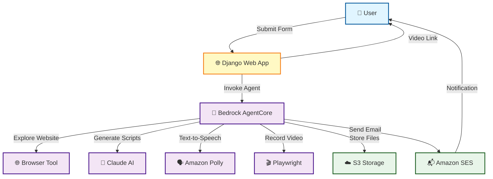

# Kirbuk Architecture - Simplified

```mermaid
flowchart TB
    User[👤 User] -->|Submit Form| Django[🌐 Django Web App]
    Django -->|Invoke Agent| Bedrock[🤖 Bedrock AgentCore]

    Bedrock -->|Explore Website| Browser[🌐 Browser Tool]
    Bedrock -->|Generate Scripts| Claude[🧠 Claude AI]
    Bedrock -->|Text-to-Speech| Polly[🗣️ Amazon Polly]
    Bedrock -->|Record Video| Playwright[🎬 Playwright]

    Bedrock -->|Store Files| S3[☁️ S3 Storage]
    Bedrock -->|Send Email| SES[📬 Amazon SES]

    SES -->|Notification| User
    Django -->|Video Link| User

    classDef userClass fill:#e1f5ff,stroke:#01579b,stroke-width:2px
    classDef webClass fill:#fff9c4,stroke:#f57f17,stroke-width:2px
    classDef coreClass fill:#f3e5f5,stroke:#4a148c,stroke-width:2px
    classDef storageClass fill:#e8f5e9,stroke:#1b5e20,stroke-width:2px

    class User userClass
    class Django webClass
    class Bedrock,Claude,Browser,Polly,Playwright coreClass
    class S3,SES storageClass
```
